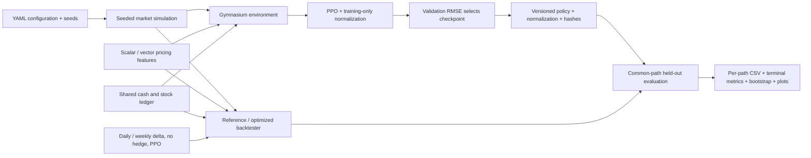

# QuantLab

A reproducible simulation and backtesting engine for evaluating option-hedging policies.

QuantLab compares analytical delta hedging and PPO using a funded portfolio ledger, identical held-out market paths, terminal risk metrics, and paired confidence intervals. It is a local Python package; Heston is exploratory, and no web service or cloud infrastructure is implemented.

## Measured evidence

See [the interview report](reports/INTERVIEW_REPORT.md) for benchmark numbers, per-seed results, confidence intervals, plots, and wording you can defend in an interview. Raw evidence lives in [benchmark.json](reports/benchmark.json) and [the controlled experiment](reports/controlled-experiment/experiment.json).

- Corrected-reference throughput improved **1.59×** on 10,000 paths: **757 → 1,206 paths/sec**, with maximum checked output difference **4.26e−14**.
- **60 automated tests pass** locally; Ruff and dependency checks pass. CI is configured for GitHub Actions.
- Three PPO training seeds, each with 100,000 configured / **100,096 actual** collected timesteps.
- **1,000 held-out paths per scenario**, six volatility/cost scenarios, all strategies on identical paths.
- PPO underperforms daily delta on terminal RMSE in every recorded scenario.
- Weekly delta reduces terminal RMSE **11.7%** and mean transaction costs **41.3%** in the 10% volatility / 10-basis-point-cost scenario. This is a scenario-specific tradeoff.
- Deterministic zero-volatility, zero-cost replication matches the funded payoff within `1e-10`.

For a file-by-file explanation, see [FILE_GUIDE.md](FILE_GUIDE.md).

## Architecture



The optimized engine precomputes path-dependent prices and Greeks. Strategies receive only the current observation, position, cash, and timestep. The reference engine independently recomputes scalar pricing features. Both use the same accounting rules.

## Repository layout

```text
src/quantlab/   All application code: pricing, simulation, accounting, strategies, and RL
configs/       Experiment configuration
tests/        Unit and integration tests
notebooks/     Exploration using the packaged evaluator
reports/       Measured results, plots, and interview report
.github/       CI workflow
```

`results/` and `checkpoints/` hold generated local artifacts and are ignored by Git. `pyproject.toml` defines the package; `requirements-lock.txt` pins the verified environment.

## Install the verified Python 3.11 environment

```bash
python3.11 -m venv .venv
.venv/bin/python -m pip install -r requirements-lock.txt
.venv/bin/python -m pip install --no-deps -e .
```

The lock records the verified environment including report dependencies. For a flexible development installation use `pip install -e '.[dev,report]'`. Notebook display additionally requires Jupyter/IPython; core commands do not.

## Accounting and action contract

One short European call receives the initial Black–Scholes premium as cash. At each step:

1. Clip the requested position change to `[-1, 1]`, then constrain the resulting stock position to `[0, 1]`.
2. Debit cash for the **executed** stock purchase and proportional trading cost.
3. Accrue positive or negative cash at `exp(r * dt)`.
4. Mark stock and the call at the next timestep.
5. At expiry sell the stock, charge liquidation costs, and pay the call payoff.

`terminal_error = final portfolio before liability settlement - call payoff`; positive is surplus, negative is shortfall. Terminal cash after settlement equals this error. Trajectory `portfolio_pnl` is the change in replication error, including financing and costs, rather than standalone stock trading profit.

`StrategyResult` includes prices, option values, executed actions, positions, cash balances, portfolio values, transaction costs, turnover (including liquidation), the error trajectory, and terminal error. At expiry positions are zero; portfolio values record the pre-settlement asset value after liquidation costs, while cash records the post-settlement surplus.

Observation v2:

```text
[log_moneyness, delta, gamma, remaining_time/T, sigma,
 executed_stock_position, cash/max(initial_premium, 1e-8)]
```

With normalized replication error `e_t`, reward is `e_t**2 - e_(t+1)**2`. With PPO `gamma=1`, the undiscounted episode reward is negative squared normalized terminal error. `lambda_risk` remains a legacy YAML field and has no effect on the v2 reward.

**Compatibility:** `funded-call-v2-observation7` changes both accounting and observations. Old checkpoints must be retrained. Model loading requires a versioned manifest and matching model/normalization hashes. Import application code through `quantlab.*`; the obsolete root-level prototype wrappers have been removed.

## Train and evaluate

```bash
# Train one seed; prints its unique checkpoint directory.
.venv/bin/python -m quantlab.rl.train --config configs/rl.yaml --seed 11

# Run all three seeds and the six-scenario held-out suite.
.venv/bin/python -m quantlab.rl.experiment --output reports/new-experiment

# Analytical baselines only.
.venv/bin/python -m quantlab.rl.evaluate --output reports/new-baselines

# Evaluate a newly trained versioned bundle.
.venv/bin/python -m quantlab.rl.evaluate --model checkpoints/RUN_DIRECTORY/best.zip \
  --output reports/new-model-evaluation
```

Model bundles contain `best.zip`, `best.pkl` normalization statistics, and `best.json` version/hash metadata. Checkpoint directories are unique; existing runs are not overwritten. Large checkpoint/training artifacts are ignored by Git; the compact evaluation evidence is tracked. Train the models again to reproduce a bundle from a fresh checkout.

Training logs flush every 256 rows. Validation evaluates **200 fixed paths** at intervals of 25,000 collected steps and at training completion. The checkpoint with the lowest validation terminal RMSE is retained together with the normalization statistics at that point.

| Split | Seeds |
|---|---|
| Training runs | 11, 22, 33 |
| Validation paths | 100000–100199 |
| Held-out test paths | 200000–200999 |

Training normalization updates only during learning and remains frozen for evaluation. Test outcomes are never used for checkpoint selection. Configurable test ranges are checked for overlap with reserved validation/training seeds.

The experiment trains at `sigma=0.2`, `cost_rate=0.001`, then tests GBM volatilities `0.1/0.2/0.4` and costs `0/0.001`. Other volatilities/costs represent distribution shift. Seeds define independent paths within each scenario; scenarios share random shocks, and all trained models reuse the same test paths.

## Metrics and uncertainty

Metrics across **terminal path outcomes**:

- Mean absolute error, RMSE, signed bias, P95 absolute error.
- Worst-5% positive shortfall mean: the largest `ceil(0.05 * n)` values of `max(-error, 0)`.
- Mean total transaction cost and stock turnover.
- Paired candidate-minus-daily-delta MAE/RMSE differences with 2,000 percentile bootstrap resamples; negative is better.

Intervals are conditional on each trained model. Reports preserve each training seed separately. Legacy `hedging_metrics()` remains available for within-trajectory diagnostics and is not used to estimate cross-path terminal risk.

`per_path.csv` stores every outcome. `metrics.json` records full config, provenance, model hashes, seeds, metrics, uncertainty, and inference time. Simulation and policy inference use bounded chunks; path generation is invariant to chunk size.

## Benchmark and render reports

Run benchmarks after other CPU-heavy jobs finish:

```bash
.venv/bin/python -m quantlab.backtesting.benchmark --output reports/new-benchmark.json
.venv/bin/python -m quantlab.rl.report \
  --experiment reports/new-experiment/experiment.json \
  --benchmark reports/new-benchmark.json --output reports/new-report.md
```

Benchmarks compare **corrected** reference and optimized implementations on 100, 1,000, and 10,000 paths, with warm-up and five repetitions. Path generation is excluded; feature precomputation remains timed. Reports include median/P95 wall time, throughput, and a separate traced-memory measurement. `tracemalloc` does not include every native allocation; it is not total process RAM. Complete numerical outputs are checked on 100 representative benchmark paths and multiple parameterized test scenarios.

The notebook displays plots and results from this same evaluator; it does not download historical data or reconstruct errors from reward proxies.

## Tests and CI

```bash
.venv/bin/python -m ruff check .
.venv/bin/python -m pytest -q
```

GitHub Actions installs the locked Python 3.11 environment and runs both checks. Tests cover hand-calculated financing/trades/settlement, zero-volatility replication, position limits, scalar/vector pricing, reference/environment parity, telescoping rewards, chunk-independent paths, invalid inputs, terminal metrics, paired bootstrap, and training/loading/evaluation smoke behavior.

## Limitations and next steps

- Single European call, synthetic GBM, proportional costs, identical lending/borrowing rates; no real-market execution claim.
- Bounded PPO training is a measured experiment, not a tuned research result.
- Heston path generation remains exploratory: fixed-volatility Black–Scholes valuation proxy and incomplete drift semantics. Controlled training/evaluation reject Heston configurations.
- Determinism is scoped to the verified CPU environment; exact floating-point results can vary across hardware/library versions.
- Backend API, durable jobs, deployment, historical option datasets, SAC comparison, and UI are deferred.

See the report for an interview walkthrough and numerical resume wording grounded in the measured evidence.
