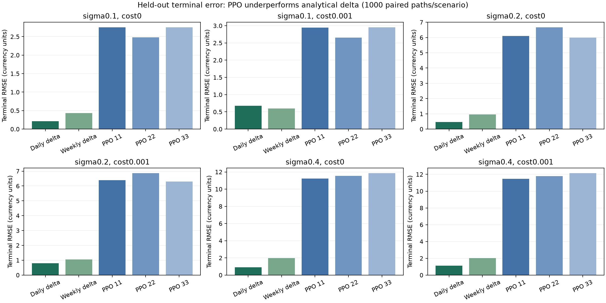
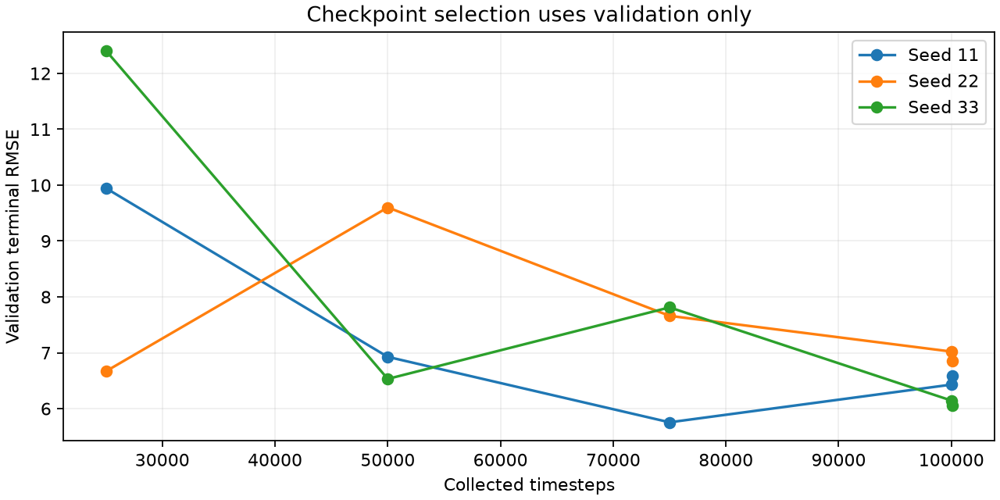
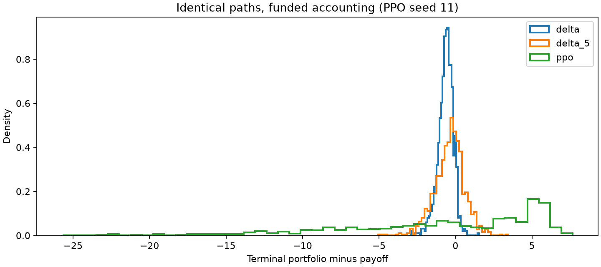

# QuantLab: measured interview evidence

This report is generated from stored outcomes. It does not rerun or select models using test results.

## Correctness and reproducibility

The v2 ledger funds one short call with its initial premium, accounts for trades and cash interest, liquidates stock with costs, and settles the payoff. Terminal error is portfolio minus liability. The deterministic zero-volatility/no-cost replication test passes within 1e-10.

Training seeds: **11, 22, 33**. Validation: **100000–100199**. Test: **200000–200999**. Six volatility/cost scenarios use the same 1000 path seeds. These are 6000 scenario-path cases, not 18000 independent samples across models; scenarios also share underlying random shocks.

## Training and held-out results

| Seed | Actual steps | Selected validation RMSE | Training + validation seconds |
|---|---:|---:|---:|
| 11 | 100096 | 5.7555 | 22.68 |
| 22 | 100096 | 6.6687 | 23.38 |
| 33 | 100096 | 6.0512 | 30.59 |

Times above were collected while another local benchmark ran; they are descriptive, not an isolated training-performance comparison.

| Scenario | Daily delta RMSE | Weekly delta RMSE | PPO 11 | PPO 22 | PPO 33 |
|---|---:|---:|---:|---:|---:|
| sigma0.1_cost0 | 0.2156 | 0.4339 | 2.7507 | 2.4825 | 2.7550 |
| sigma0.1_cost0.001 | 0.6735 | 0.5946 | 2.9453 | 2.6555 | 2.9565 |
| sigma0.2_cost0 | 0.4605 | 0.9624 | 6.0997 | 6.6748 | 5.9926 |
| sigma0.2_cost0.001 | 0.8014 | 1.0556 | 6.3835 | 6.8618 | 6.2973 |
| sigma0.4_cost0 | 0.9102 | 1.9657 | 11.2314 | 11.5471 | 11.8535 |
| sigma0.4_cost0.001 | 1.1170 | 2.0211 | 11.4742 | 11.7974 | 12.1378 |

**All three PPO models underperform daily delta on terminal RMSE in every tested scenario.** Lower PPO trading costs do not establish a better hedge; error must be considered alongside cost.







### Paired uncertainty in the default scenario

Intervals resample price paths, conditional on each trained model. Negative differences favor PPO.

| Seed | PPO − delta RMSE | Paired 95% bootstrap CI |
|---|---:|---|
| 11 | 5.5821 | [5.2455, 5.8998] |
| 22 | 6.0604 | [5.7334, 6.3824] |
| 33 | 5.4960 | [5.1415, 5.8506] |

A useful observed tradeoff: weekly delta reduces terminal RMSE by **11.7%** and mean transaction costs by **41.3%** in the 10% volatility, 10-basis-point-cost scenario. The paired RMSE difference CI is [-0.1077, -0.0495]. This result is scenario-specific; weekly rebalancing performs worse in several other scenarios.

## Corrected-reference performance

Five timed repetitions after warm-up. Path generation is excluded; feature computation is included. Memory is traced separately and excludes some native allocations.

| Paths | Reference median / P95 (s) | Optimized median / P95 (s) | Speedup | Optimized paths/s | Peak traced MiB | Maximum difference |
|---|---:|---:|---:|---:|---:|---:|
| 100 | 0.131 / 0.131 | 0.081 / 0.082 | 1.61× | 1234.2 | 0.78 | 4.26e-14 |
| 1000 | 1.317 / 1.319 | 0.813 / 0.816 | 1.62× | 1230.7 | 2.42 | 4.26e-14 |
| 10000 | 13.203 / 13.368 | 8.289 / 8.339 | 1.59× | 1206.5 | 2.42 | 4.26e-14 |

## Interview wording

“Built a reproducible Python option-hedging engine and improved corrected-reference throughput **1.59×** across a 10000-path workload, with maximum checked output difference **4.26e-14**.”

“Compared PPO and analytical baselines across three training seeds and six held-out scenarios; validated financing and settlement, and reported paired uncertainty and cost–risk tradeoffs.”

## Limits and follow-up

Synthetic GBM evaluation of a single European call; no real-market execution evidence. Models trained at 20% volatility are stress-tested at 10% and 40%; those results include distribution shift. Heston remains a fixed-volatility valuation proxy with incomplete drift semantics. No API, persistent job queue, frontend, or cloud deployment is implemented. Future work: Heston consistency, reward/training-budget ablations, then a bounded backend service.

## Reproduce

```bash
python -m quantlab.rl.experiment --output reports/new-experiment
python -m quantlab.backtesting.benchmark --output reports/new-benchmark.json
python -m quantlab.rl.report --experiment reports/new-experiment/experiment.json --benchmark reports/new-benchmark.json --output reports/new-report.md
```
